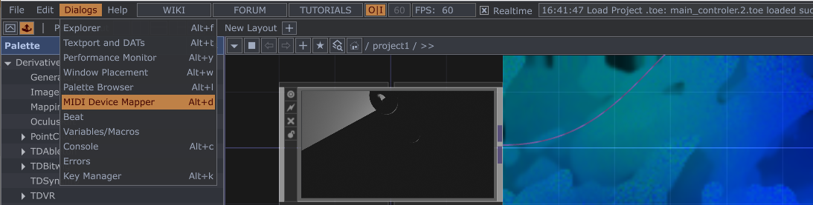
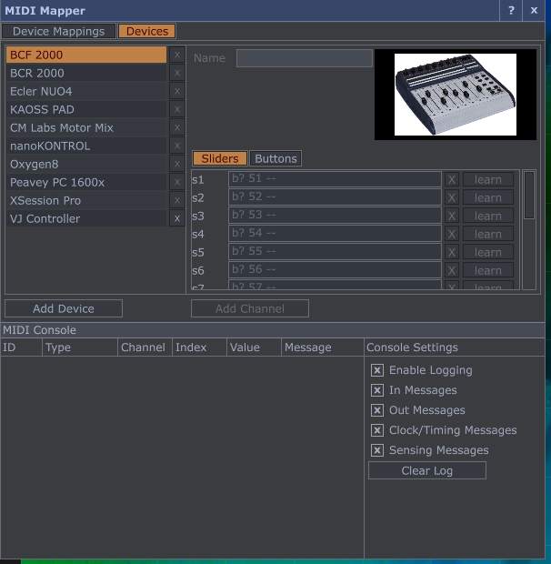
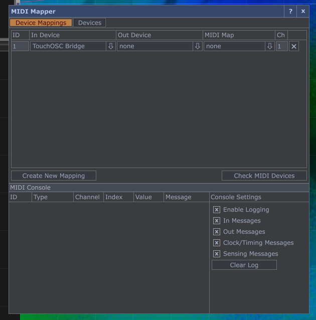

# main
This is the main repo that combines everything together

# To setup the MIDI Controler as input

The video [here](https://alltd.org/basic-midi-keyboard-visualisation-touchdesigner-tutorial/) has the mapping setup

