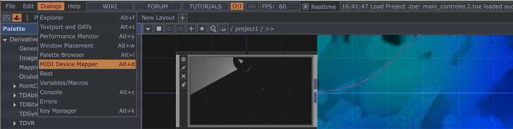
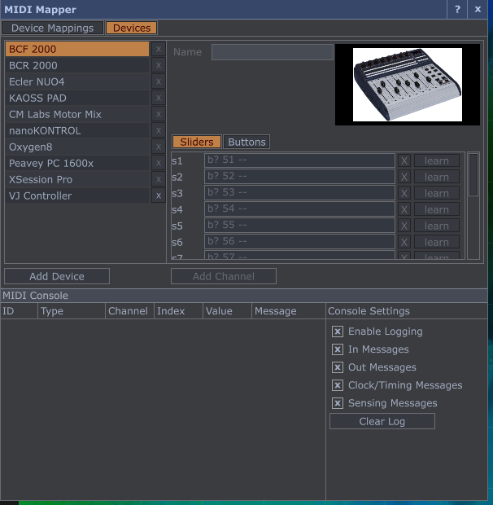
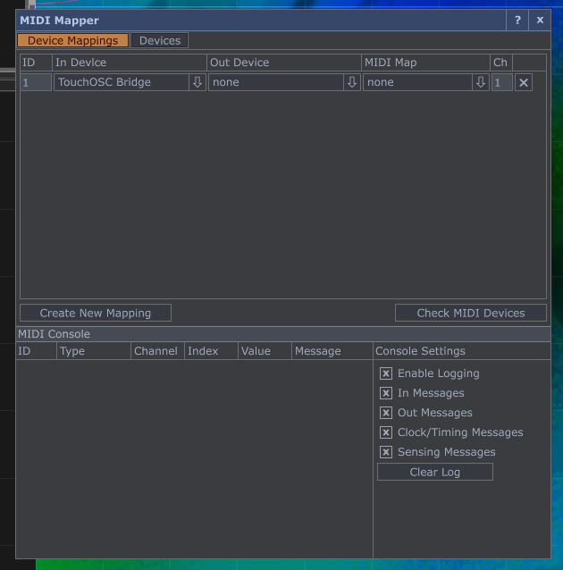

# Instructions on how to create the MIDI controller

This has to be done whenever using the main controller with a different controller

The video [here](https://alltd.org/basic-midi-keyboard-visualisation-touchdesigner-tutorial/) has the mapping setup