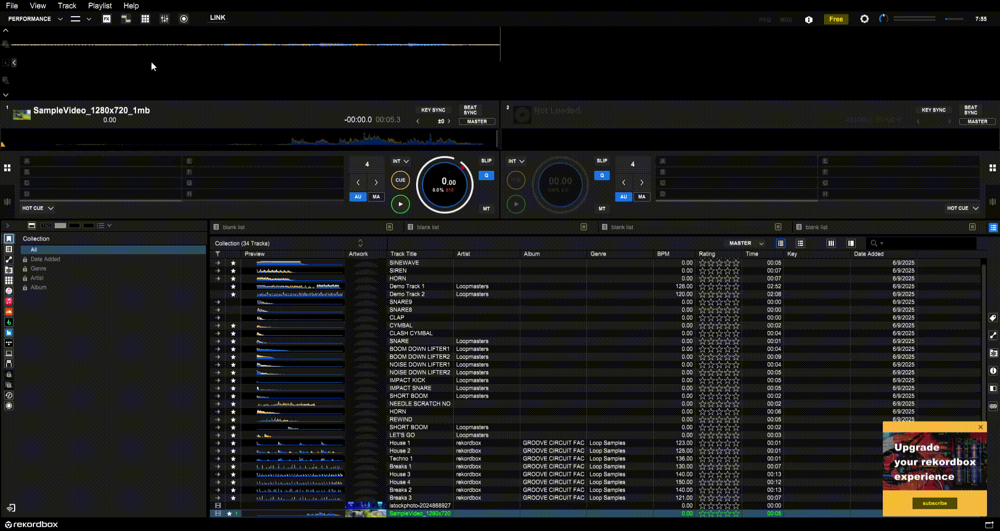

1. Check Video Preferences:
	Go to Preferences > Extensions > Video.
	Make sure the Enable Video Function checkbox is ticked (selected).

2. Click the video button that appear in taskbar (see video for more details)

3. Load in track

4. Double click to have it pop out

