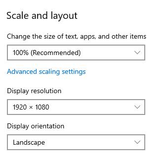

1. Check Video Preferences:
	Go to Preferences > Extensions > Video.
	Make sure the Enable Video Function checkbox is ticked (selected).

2. Click the video button that appear in taskbar (see video for more details)

3. Load in track

4. Double click to have it pop out


Once this is done you should be able to display videos, but owe noes, rekirdbox is adding a bar across. We will get around this by modifying the video so the bar is ontop of nothing, then modiftying the screen.

To modify your music videos to be outside the bar that recordbox has there is a helper function. This runs the python file on the first mp4, outputs to the second mp4, then makes sure to use the resolution specified at the end

```
python3 convert_music.py videos/sample.mp4 output.mp4 1280 720 
```

It also supports output information after. This will add a gap inbetween your video (this will be removed later)

To display your visuals on a seperate screen I like the virtual display adaptor located [here](https://github.com/VirtualDrivers/Virtual-Display-Driver/releases)

The resolution should match this. .

Also make sure to launch the rekordbox video until it is small. Then make bigger. Then shove over using windows shift arrow. There are 2 different resolution this can launch and it matters down to the pixel.

Make sure to have extend display. This is a good [video](https://www.youtube.com/watch?v=jN5YnHlC0fE). It also shows you how to control resolution which is helpful. Use Windows + Shift + Left/Right Arrow to move the window around easily.

Use the broadcast_screen.toe to broadcast to people on your local network. This file also removes the gap added to your video.

Use the ndi_out.tox to capture this for visuals

### Side notes

There needs to be a networking connection between the computers.

1. Using wireless while on same network is slow

2. Can instead plug the computers directly together with ethernet. This requires setting static ip addresses on both machines. A good tutorial for win10 is [here](https://www.youtube.com/watch?v=uZhhZC68aPM). 

3. Can use a router as a DHCP server and just plug directly into it to get assigned addresses.
