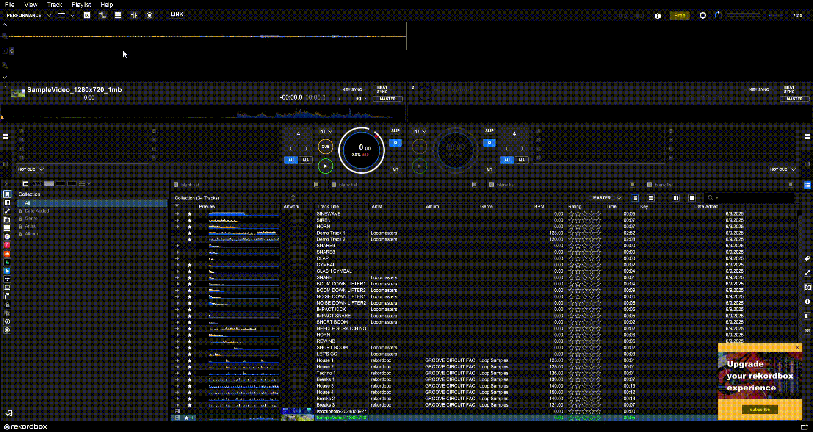

1. Check Video Preferences:
	Go to Preferences > Extensions > Video.
	Make sure the Enable Video Function checkbox is ticked (selected).

2. Click the video button that appear in taskbar (see video for more details)

3. Load in track

4. Double click to have it pop out



Once this is done you should be able to display videos, but owe noes, rekirdbox is adding a bar across. We will get around this by modifying the video so the bar is ontop of nothing, then modiftying the screen.

To modify your music videos to be outside the bar that recordbox has there is a helper function

```
python3 convert_music.py videos/test_input.mp4
```

It also supports output information after. This will add the black bar to your video

Use the broadcast_screen.toe to broadcast to people on your local network.

Use the ndi_out.tox to capture this for visuals